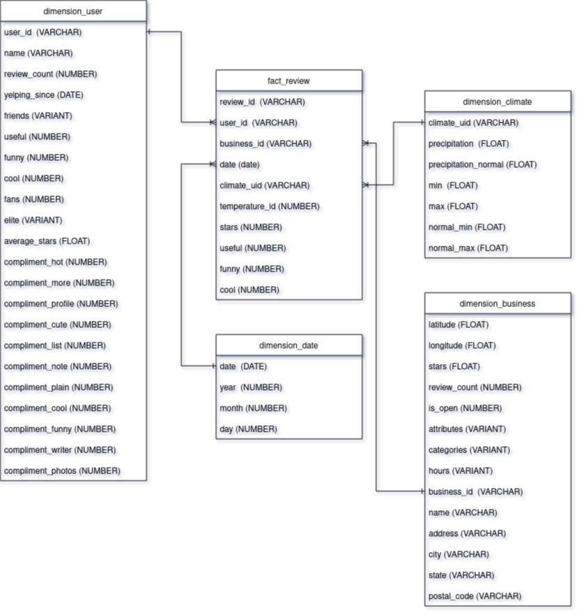
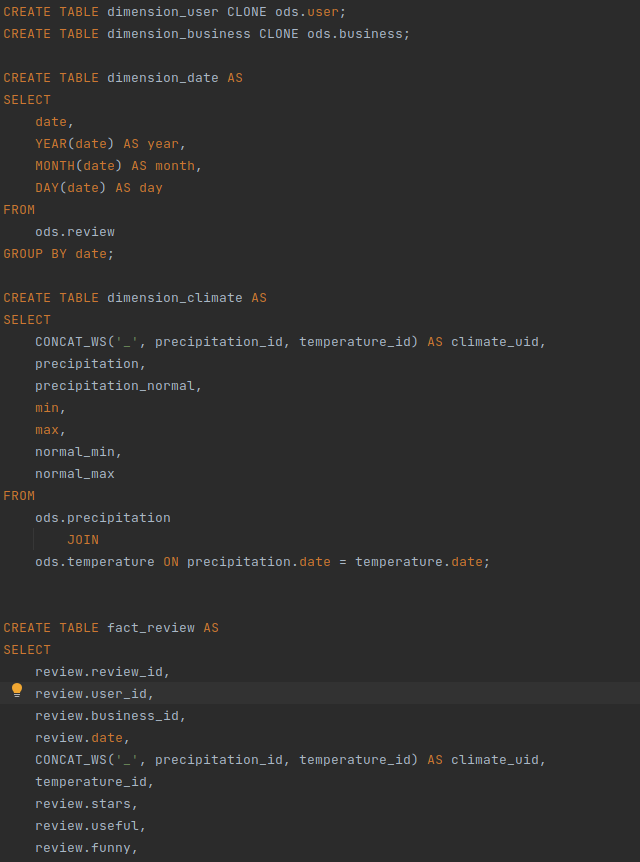

# Weather and Restaurants

- Files
  - **1 - Create Statements:** create database and schemas
    - Staging: (2-7)
    - ODS:
    - DHW: 

## Data architecture


## Operational data store - ERD


## Data Ware House - ERD


# Yelp Data examples
## User
```
{
    "user_id": "Ha3iJu77CxlrFm-vQRs_8g", // string, 22 character unique user id, maps to the user in user.json
    "name": "Sebastien", // string, the user's first name
    "review_count": 56, // integer, the number of reviews they've written
    "yelping_since": "2011-01-01", // string, when the user joined Yelp, formatted like YYYY-MM-DD
    "friends": [
        "wqoXYLWmpkEH0YvTmHBsJQ",
        "KUXLLiJGrjtSsapmxmpvTA",
        "6e9rJKQC3n0RSKyHLViL-Q"
    ], // array of strings, an array of the user's friend as user_ids
    "useful": 21, // integer, number of useful votes sent by the user
    "funny": 88, // integer, number of funny votes sent by the user
    "cool": 15, // integer, number of cool votes sent by the user
    "fans": 1032, // integer, number of fans the user has
    "elite": [
        2012,
        2013
    ], // array of integers, the years the user was elite
    "average_stars": 4.31, // float, average rating of all reviews
    "compliment_hot": 339, // integer, number of hot compliments received by the user
    "compliment_more": 668, // integer, number of more compliments received by the user
    "compliment_profile": 42, // integer, number of profile compliments received by the user
    "compliment_cute": 62, // integer, number of cute compliments received by the user
    "compliment_list": 37, // integer, number of list compliments received by the user
    "compliment_note": 356, // integer, number of note compliments received by the user
    "compliment_plain": 68, // integer, number of plain compliments received by the user
    "compliment_cool": 91, // integer, number of cool compliments received by the user
    "compliment_funny": 99, // integer, number of funny compliments received by the user
    "compliment_writer": 95, // integer, number of writer compliments received by the user
    "compliment_photos": 50 // integer, number of photo compliments received by the user
}
```

## Review
```
{
    "review_id": "zdSx_SD6obEhz9VrW9uAWA", // string, 22 character unique review id
    "user_id": "Ha3iJu77CxlrFm-vQRs_8g", // string, 22 character unique user id, maps to the user in user.json
    "business_id": "tnhfDv5Il8EaGSXZGiuQGg", // string, 22 character business id, maps to business in business.json
    "stars": 4, // integer, star rating
    // string, date formatted YYYY-MM-DD
    "date": "2016-03-09", // string, date formatted YYYY-MM-DD
    "text": "Great place to hang out after work: the prices are decent, and the ambience is fun. It's a bit loud, but very lively. The staff is friendly, and the food is good. They have a good selection of drinks.", // string, the review itself
    "useful": 0, // integer, number of useful votes received
    "funny": 0, // integer, number of funny votes received
    "cool": 0 // integer, number of cool votes received
}
```

## Business
```
{
    "business_id": "tnhfDv5Il8EaGSXZGiuQGg", // string, 22 character unique string business id
    "name": "Garaje", // string, the business's name
    "address": "475 3rd St", // string, the full address of the business
    "city": "San Francisco", // string, the city
    "state": "CA", // string, 2 character state code, if applicable
    "postal code": "94107", // string, the postal code
    "latitude": 37.7817529521, // float, latitude
    "longitude": -122.39612197, // float, longitude
    "stars": 4.5, // float, star rating, rounded to half-stars
    "review_count": 1198, // integer, number of reviews
    "is_open": 1, // integer, 0 or 1 for closed or open, respectively
    "attributes": {
        "RestaurantsTakeOut": true,
        "BusinessParking": {
            "garage": false,
            "street": true,
            "validated": false,
            "lot": false,
            "valet": false
        },
    }, // object, business attributes to values. note: some attribute values might be objects
    "categories": [
        "Mexican",
        "Burgers",
        "Gastropubs"
    ], // an array of strings of business categories
    "hours": {
        "Monday": "10:00-21:00",
        "Tuesday": "10:00-21:00",
        "Friday": "10:00-21:00",
        "Wednesday": "10:00-21:00",
        "Thursday": "10:00-21:00",
        "Sunday": "11:00-18:00",
        "Saturday": "10:00-21:00"
    } // an object of key day to value hours, hours are using a 24hr clock
}
```

## Checkin
```
{
    "business_id": "tnhfDv5Il8EaGSXZGiuQGg", // string, 22 character business id, maps to business in business.json
    "date": "2016-04-26 19:49:16, 2016-08-30 18:36:57, 2016-10-15 02:45:18, 2016-11-18 01:54:50, 2017-04-20 18:39:06, 2017-05-03 17:58:02" // string which is a comma-separated list of timestamps for each checkin, each with format YYYY-MM-DD HH:MM:SS
}
```

## Covid
```
{
    "business_id": "H6D5HOTfMjrZt7r1EObZ1g",
    "highlights": "FALSE",
    "delivery or takeout":"FALSE",
    "Grubhub enabled":"FALSE",
    "Call To Action enabled":"FALSE",
    "Request a Quote Enabled":"FALSE",
    "Covid Banner":"FALSE",
    "Temporary Closed Until":"FALSE",
    "Virtual Services Offered":"FALSE"
}
```

## Tip
```
{
    "text": "Secret menu - fried chicken sando is da bombbbbbb Their zapatos are good too.",  // string, text of the tip
    "date": "2013-09-20", // string, when the tip was written, formatted like YYYY-MM-DD
    "compliment_count": 172, // integer, how many compliments it has
    "business_id": "tnhfDv5Il8EaGSXZGiuQGg", // string, 22 character business id, maps to business in business.json
    "user_id": "49JhAJh8vSQ-vM4Aourl0g" // string, 22 character unique user id, maps to the user in user.json
}
```

## Screenshot
### (1 - 2): Staging Yelp and Climate table sizes


### [3: Code that transforms staging to ODS](sql/to_ODS.sql)


### [4: JSON functions to transform data](sql/to_ODS.sql)


### 5: sizes of raw files, staging, ODS


### 6: SQL queries to integrate climate and Yelp data

```
SELECT 
    *
FROM
    precipitation -- Climate
		JOIN
	temperature ON temperature.date = precipitation.date
        JOIN -- YELP
    review ON review.date = temperature.date
        JOIN
    business ON business.business_id = review.business_id
        JOIN
    tip ON tip.business_id = business.business_id
		AND tip.date = precipitation.date
        JOIN
    checkin ON checkin.business_id = business.business_id
        JOIN
    covid ON covid.business_id = business.business_id;
```

### [7: Transforms ODS to DWH](sql/to_DWH.sql)


### 8: Reviews

```
SELECT 
    fact_review.date,
    dimension_business.name,
    dimension_climate.precipitation,
    dimension_climate.precipitation_normal,
    dimension_climate.min,
    dimension_climate.max,
    dimension_climate.normal_min,
    dimension_climate.normal_max,
    fact_review.stars,
    fact_review.useful,
    fact_review.funny,
    fact_review.cool
FROM
    fact_review
		JOIN
    dimension_business ON dimension_business.business_id = fact_review.business_id
		JOIN
	dimension_climate ON dimension_climate.climate_uid = fact_review.climate_uid
```